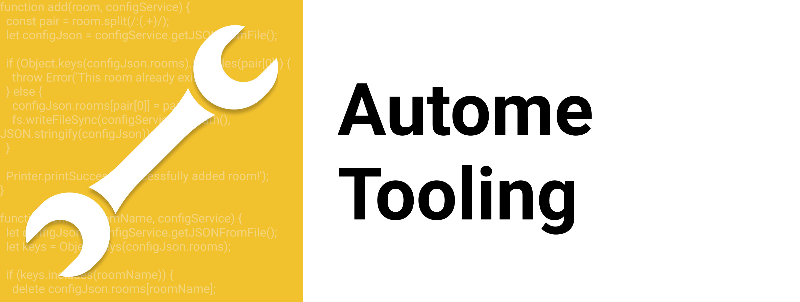

# Zoom CLI
 

A Zoom cli for developers who like the command line!

## Installation

* `npm i -g @autome/zoom-cli`

## Commands

Here are the commands that this package provides.

### Add a Zoom room
`zoom -a [room:url]` `zoom --add [room:url]`

This command adds a new Zoom room link to your configuration. Make sure that you provide a key, which is the name of the Zoom room, along with the url to the Zoom room. Make sure that your separate the two with a `:`. For example, `zoom -a myNewRoom:https://zoom.us/exampleurl/`.

+ `zoom -l [room name]`: This command opens up a Zoom meeting in the browser
+ `zoom -r [room name]` || `zoom --remove [room name]`: This command removes the Zoom room from your configuration.
+ `zoom -u` || `zoom --update`: This command updates your Zoom client.
+ `zoom --list`: This command lists all of the rooms that you currently have in your configuration.

## Testing

If you want to run the tests using VSCode, you must do the following steps
1. Install the [Mocha Test Explorer](https://marketplace.visualstudio.com/items?itemName=hbenl.vscode-mocha-test-adapter)
2. Add `"mochaExplorer.files": "src/test/**/*.js"` and `"mochaExplorer.require": "@babel/register"` to your vsCode `settings.json` file.
3. Now you should be able to run the Mocha tests through the Test Explorer in vsCode.

*Support*: Feel free to submit an issue if you find a bug or want a new feature.
